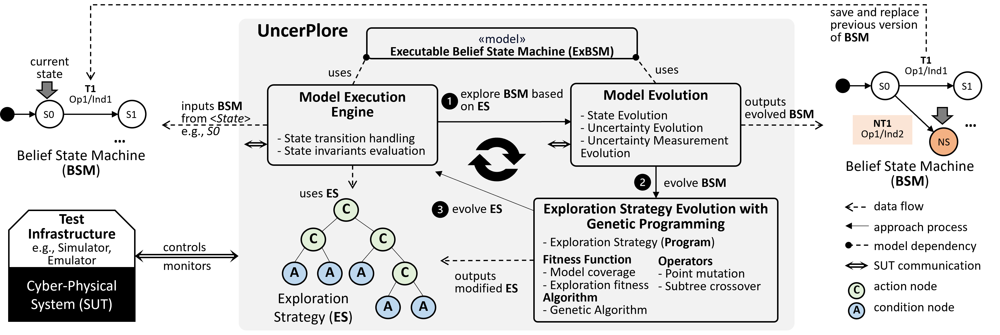
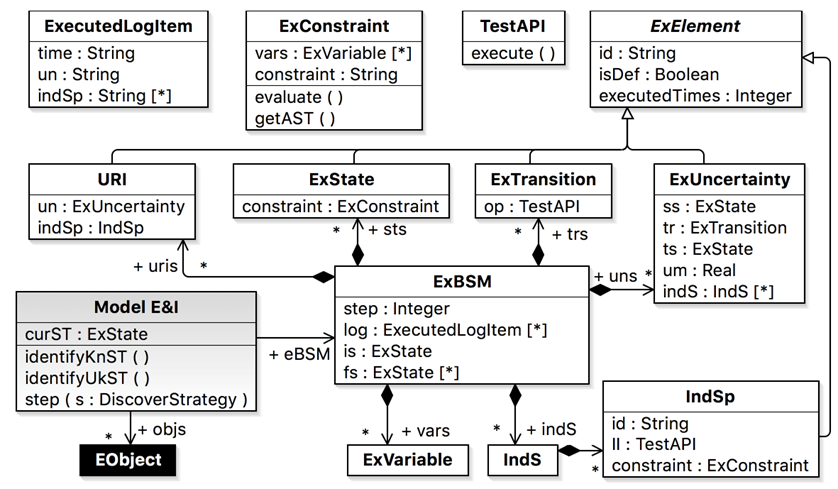

# UncerPlore: Uncertainty-wise Model Evolution with Genetic Programming

|  | 
|:-----------------------------:| 
|   *Overview of UncerPlore*    |

- [uncerplore](uncerplore): source code of our tool.
- [project deliverable](https://cordis.europa.eu/project/id/645463/results): The idea is orignated from an EU H2020 U-Test project. The previous version can be found in Section 2.4.1.2 (Uncertainty Testing Framework V.3).

### Build the tool

#### Dependency ####

* [MOEA Framework](http://moeaframework.org/)
* [Eclipse Modeling Tools](https://www.eclipse.org/downloads/packages/release/2022-03/r/eclipse-modeling-tools)
* [How to process OCL Abstract Syntax Trees](https://www.eclipse.org/articles/Article-HowToProcessOCLAbstractSyntaxTrees/index.html)
* [gson](https://github.com/google/gson) and [jdom](http://www.jdom.org/)

#### Libraries ####
If you want to build the tool with source code, you need to add libraries that are not available in Maven Central Repository as follows

- org.eclipse.emf.common_2.28.0.v20230223-0922.jar
- org.eclipse.emf.ecore.xmi_2.18.0.v20230211-1150.jar
- org.eclipse.emf.ecore_2.33.0.v20230226-0921.jar
- org.eclipse.emf.mapping.ecore2xml_2.12.0.v20230211-1150.jar
- org.eclipse.ocl.common_1.18.0.v20221201-0557.jar
- org.eclipse.ocl.ecore_3.18.0.v20221201-0557.jar
- org.eclipse.ocl.uml_5.18.0.v20221201-0557.jar
- org.eclipse.ocl_3.18.0.v20221201-0557.jar
- org.eclipse.uml2.common_2.5.0.v20221116-1811.jar
- org.eclipse.uml2.types_2.5.0.v20221116-1811.jar
- org.eclipse.uml2.uml.resources_5.5.0.v20221116-1811.jar
- org.eclipse.uml2.uml_5.5.0.v20221116-1811.jar
- org.eclipse.uml2_5.5.3.v20221116-1811.jar
- jdom.jar
- OCLASTView.jar

### Executable Belief State Machine

|                                 | 
|:------------------------------------------------------:| 
| *Metamodel of Executable Belief State Machine (ExBSM)* |

#### Definitions ####
|Concept Name   | Definitions                                                                                                                                                                                                                            |
|---------------|----------------------------------------------------------------------------------------------------------------------------------------------------------------------------------------------------------------------------------------|
|ExBSM          | This concept maps with belief state machine («BeliefElement» state machine) defined in the belief model. **is** indicates the initial state. **fs** indicates the set of final states.                                                 |
|ExState        | This concept maps with the state defined in the belief state machine. Also, the state invariant for each state is converted to ExConstraint.                                                                                           |
|ExTransition   | This concept maps with the transition defined in the belief state machine. Also, we map the trigger in the transition to the specific Test API.                                                                                        |
|ExUncertainty  | This concept maps with the uncertainty defined in the state stereotyped «BeliefElement».                                                                                                                                               |
|URI            | URI (**U**ncertainty **R**elated to **I**ndeterminacy Specification) is the occurrence association between uncertainty and indeterminacy specification defined in the `relatedIndSp:Uncertainty`.                                      |
|IndS           | IndS is the **Ind**eterminacy **S**ource which maps to the element stereotyped as «indeterminacySource» in belief state machine.                                                                                                       |
|IndSp          | IndSp is the **Ind**eterminacy **S**pecification that is constraint defined in the belief model stereotyped «IndeterminacySpecification». The constraint is converted into ExConstraint associated with this IndSp.                    |
|ExConstraint   | This concept maps with the state invariant defined on the state and indeterminacy defined in the indeterminacy source.                                                                                                                 |
|ExVariable     | This concept maps with the PropertyCallExp defined in the constraint. Also, we convert each constraint into abstract syntax tree.                                                                                                      |
|ExecutedLogItem| It records the process of execution. **un** indicates the occurrence of uncertainty. time indicates the time point when un is executed. indSp indicates a set of occurrence of indeterminacy specification at that specific time point. |
|ExElement      | It is used to describe the execution situation. **isDef** indicates if the element is defined in the belief state machine. executedTimes is used to define the times that element is executed.                                         |

### Get Started

In order to apply UncerPlore, you have to  
- have a runnable program of the SUT
- extend `no.simula.se.uncertainty.evolution.domain.UncertainWorld` to specify what parameters and objects of the models can be explored.
- implement `no.simula.se.uncertainty.evolution.cs.SutController` to handle SUT, such as reset, and stop.

##### Covert Belief Model to Executable Belief Model
With `no.simula.se.uncertainty.evolution.UncerPloreRunner`, we provide a method `covertBM2ExBM` to facilitating a model transformation from the belief model to executable belief model.

##### Run

With `no.simula.se.uncertainty.evolution.UncerPloreRunner`, we provide a method `run` to start the model evolution and uncertainty exploration with UncerPlore.

